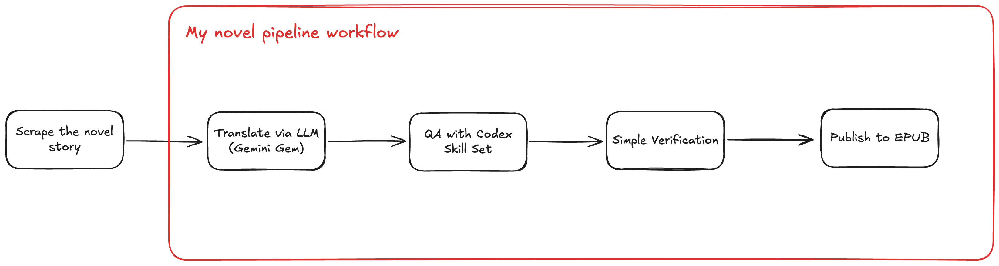

# Novel Translation Pipeline



An automation toolkit for turning manually collected English web-novel chapters into polished Thai EPUB files.

The main workflow starts from local `.txt` chapter files, sends them through a supervised Gemini translation step, prepares a final working folder, runs Codex-assisted Thai novel QA/polishing, verifies the output, and builds EPUB books.

## What It Does

- Processes chapter ranges from local text files.
- Automates a custom Gemini Gem translation workflow through a visible Playwright browser.
- Preserves raw Gemini output separately from final edited files.
- Uses Codex with a Thai novel QA/polishing skill for line editing, title cleanup, pronoun/register checks, and prose polish.
- Adds missing chapter headings from filenames when Gemini omits them.
- Detects leftover English/source-language text, untranslated headings, suspicious pronouns, and missing chapters before EPUB creation.
- Builds EPUB files with clean table-of-contents entries.
- Optionally generates and applies cover images.

## Current Pipeline

```text
novel_chapters/
  English input files from manual scraping
        |
        v
novel_gemini_translated/
  Raw Gemini Thai output
        |
        v
novel_final/
  Codex-polished Thai files with normalized headings
        |
        v
pipeline_reports/
  Verification reports
        |
        v
ebooks/
  Final EPUB output
```

Scraping is intentionally outside the main pipeline. Put manually collected English chapters into `novel_chapters/`, then run the pipeline.

## Tech Stack

- Python 3.12+
- Playwright
- Gemini web UI automation
- Codex CLI
- Custom Codex Thai novel QA skill
- EbookLib
- BeautifulSoup / Requests / cloudscraper for legacy scraping utilities

## Repository Layout

```text
CODEX_QA_SKILL.md          Shareable description of the Codex QA skill
novel_pipeline.py           Main no-scrape end-to-end pipeline
automate_gemini_gem.py      Supervised Gemini Gem browser automation
make_epub_batches.py        EPUB builder
automate_chatgpt_covers.py  Optional cover generation automation
apply_epub_covers.py        Optional EPUB cover injector
translation_qa_workflow.py  Older deterministic QA helper
tess.py                     Legacy SkyDemonOrder link collector
scape_dynamic.py            Legacy chapter scraper
requirements.txt            Python dependencies
```

Generated folders are ignored by Git:

```text
novel_chapters/
novel_gemini_translated/
novel_final/
pipeline_reports/
ebooks/
images/
```

Small preview EPUBs are available under [samples/](samples/). They are trimmed excerpts for portfolio review, not full generated books.

## Setup

Create and activate a virtual environment:

```bash
python3 -m venv .venv
source .venv/bin/activate
```

Install dependencies:

```bash
python -m pip install -r requirements.txt
python -m playwright install chromium
```

Log in once to the tools used by the supervised browser steps:

- Gemini, for translation.
- ChatGPT, only if using cover generation.
- Codex CLI, for the Thai polishing step.

Check Codex is available:

```bash
codex --help
```

## Input File Format

Place English source chapters in:

```text
novel_chapters/
```

Expected filename format:

```text
0820__820_My_Kids_Are_A_Little_Rough_5.txt
0821__821_I_Won_This_War_1.txt
```

The pipeline uses the leading chapter number for range selection. The filename title is also used to generate a heading when Gemini omits one.

Example generated heading:

```text
ตอนที่ 820 - My Kids Are A Little Rough (5)
```

During the Codex polishing step, English title text in generated headings is translated into Thai while preserving the chapter number and part marker.

See [CODEX_QA_SKILL.md](CODEX_QA_SKILL.md) for the shareable QA skill workflow and editing rules used by the Codex polishing step.

## Custom Gemini Gem

The Gemini translation step uses a custom Gem instead of a generic prompt. The Gem is seeded with project-specific reference material:

- Character name mappings and preferred Thai spellings.
- Sect, place, technique, and world-building terminology.
- World setup and relationship context.
- Short sample Thai translations that demonstrate the target prose style.
- Instructions to translate in a wuxia / martial-arts novel voice with clear emotion, hierarchy, tension, comedy, and action rhythm.

The Gem produces the first Thai draft. Codex then performs the stricter QA pass for headings, pronouns, register, prose compacting, and final EPUB readiness.

## End-To-End Usage

Run everything for a chapter range:

```bash
.venv/bin/python novel_pipeline.py \
  --start 820 \
  --end 825 \
  --all
```

This runs:

1. Validate English source files in `novel_chapters/`.
2. Translate with Gemini into `novel_gemini_translated/`.
3. Copy translated files into `novel_final/`.
4. Add missing chapter headings.
5. Run Codex Thai novel polishing.
6. Verify final files.
7. Build EPUB into `ebooks/`.

The Gemini step is supervised. A browser opens, you log in if needed, confirm the Gem chat is ready, then press Enter in the terminal.

## Resume Commands

If translation already finished and you only need final polish plus EPUB:

```bash
.venv/bin/python novel_pipeline.py \
  --start 820 \
  --end 825 \
  --prepare-final \
  --polish-with-codex \
  --verify \
  --make-epub
```

If final files already exist and you only need verification plus EPUB:

```bash
.venv/bin/python novel_pipeline.py \
  --start 820 \
  --end 825 \
  --verify \
  --make-epub
```

If verification finds error-level issues but you intentionally want to build anyway:

```bash
.venv/bin/python novel_pipeline.py \
  --start 820 \
  --end 825 \
  --verify \
  --make-epub \
  --allow-verify-errors
```

## Useful Pipeline Flags

```bash
--force-translate
```

Retranslate chapters even if Gemini output files already exist.

```bash
--force-final
```

Overwrite files in `novel_final/` from `novel_gemini_translated/`.

```bash
--group-by size --group-size 6
```

Control EPUB grouping manually. By default, `novel_pipeline.py` builds one EPUB for exactly the selected chapter range. For example, `--start 820 --end 825` creates one 6-chapter EPUB.

```bash
--group-by range --group-size 10
```

Build only complete 10-chapter range groups. Incomplete ranges are skipped.

## Verification

Before EPUB creation, the pipeline checks `novel_final/` for:

- Missing chapter files.
- Empty files.
- Missing or malformed chapter headings.
- English text left in the body.
- Chinese, Japanese, or Korean-script leftovers.
- Known artifact terms from machine translation.
- English title text left inside generated headings.
- Suspicious modern Thai pronouns such as `คุณ`, `พวกคุณ`, `นาย`, `พวกนาย`, `เธอ`, `หล่อน`.

Verification writes a Markdown report:

```text
pipeline_reports/0820_0825_verification.md
```

Warnings do not block EPUB creation by default. Error-level findings block EPUB creation unless `--allow-verify-errors` is passed.

## EPUB Builder

Build directly from a final folder:

```bash
.venv/bin/python make_epub_batches.py \
  --input-dir novel_final \
  --output-dir ebooks \
  --book-prefix "Return of the Mount Hua Sect" \
  --author "Rafaelx" \
  --start 820 \
  --end 825 \
  --group-by size \
  --group-size 6
```

Preview planned groups without writing EPUBs:

```bash
.venv/bin/python make_epub_batches.py \
  --input-dir novel_final \
  --start 820 \
  --end 825 \
  --group-by size \
  --group-size 6 \
  --preview
```

The EPUB builder uses an existing Thai heading when present. If a file starts directly with story text, it generates a clean chapter title from the filename so the EPUB table of contents remains readable.

## Sample Output

The [samples/](samples/) folder contains compact previews that demonstrate the final output format without including complete books. PDF versions are included so GitHub can render the samples directly in the browser:

```text
samples/Return_of_the_Mount_Hua_Sect_301-310_preview.epub
samples/Return_of_the_Mount_Hua_Sect_301-310_preview.pdf
samples/Return_of_the_Mount_Hua_Sect_724-819_preview.epub
samples/Return_of_the_Mount_Hua_Sect_724-819_preview.pdf
```

Each preview keeps the cover plus a short excerpt. The PDFs are around eight pages; EPUB page count varies by reader, device, font size, and layout settings.

## Optional Cover Workflow

Generate missing cover images through a supervised ChatGPT browser session:

```bash
.venv/bin/python automate_chatgpt_covers.py --list-missing
.venv/bin/python automate_chatgpt_covers.py --continue-on-error
```

Apply covers to EPUB files:

```bash
.venv/bin/python apply_epub_covers.py --dry-run
.venv/bin/python apply_epub_covers.py
```

Default folders:

```text
ebooks/
images/
ebooks-with-cover/
```

## Legacy Scraping Utilities

The current recommended workflow starts from manual source files in `novel_chapters/`. Older SkyDemonOrder scraping utilities remain in the repository for reference:

```bash
.venv/bin/python tess.py
.venv/bin/python scape_dynamic.py --start 256 --end 330 --output-dir mount_hua_chapters_256_330
```

These scripts are not required for the no-scrape pipeline.

## Responsible Use

Use this toolkit only with content you have the right to process. Respect source-site terms, copyright, paywalls, and access controls. The browser automation here is designed for supervised personal workflows, not for bypassing authentication, rate limits, or restrictions.
